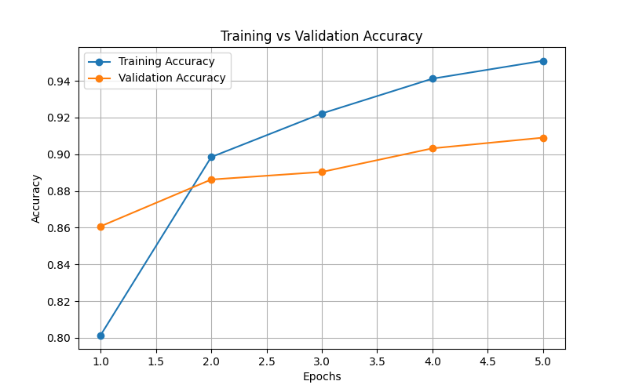
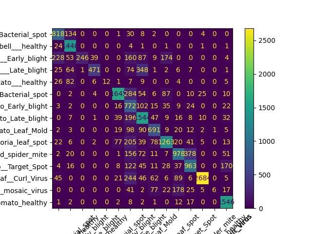
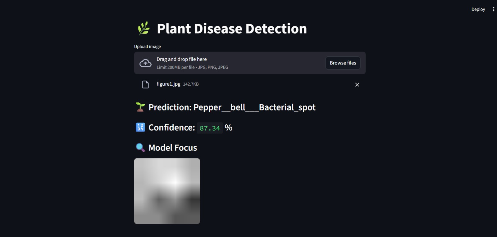

# 🌿 Plant Disease Detection using Deep Learning

## 📌 Overview

This project is a deep learning-based system that detects plant diseases from leaf images. It uses a pre-trained MobileNetV2 model (Transfer Learning) to classify plant diseases and provides visual explanations using Grad-CAM.

---

## 🚀 Features

* 🌱 Image classification of plant diseases
* 🧠 Transfer Learning using MobileNetV2
* 🔥 Grad-CAM visualization (model explainability)
* 📊 Confusion Matrix for evaluation
* 🌐 Interactive web app using Streamlit

---

## 📊 Dataset

* **PlantVillage Dataset**
* Source: https://www.kaggle.com/datasets/emmarex/plantdisease

---

## 🛠️ Technologies Used

* Python
* TensorFlow / Keras
* NumPy
* OpenCV
* Matplotlib
* Scikit-learn
* Streamlit

---

## 📁 Project Structure

```
plant-disease-detection/
│── app.py
│── train.py
│── evaluate.py
│── gradcam.py
│── requirements.txt
│── README.md
│── .gitignore
│── accuracy.png
│── confusion_matrix.png
│── classes.json
│── data/
```

---

## ▶️ How to Run the Project

### 1️⃣ Install dependencies

```
pip install -r requirements.txt
```

### 2️⃣ Train the model

```
python train.py
```

### 3️⃣ Evaluate the model

```
python evaluate.py
```

### 4️⃣ Run the web application

```
python -m streamlit run app.py
```

---

## 📷 Results

### 📈 Accuracy Graph



### 📊 Confusion Matrix



### App Output



---

## 🎯 Output

* Predicts plant disease from image
* Displays disease name
* Shows confidence percentage
* Highlights infected regions using Grad-CAM

---

## 💡 Future Improvements

* Improve model accuracy with more training
* Deploy as a cloud-based web application
* Add real-time camera detection
* Expand dataset for more plant species

---

## 👨‍💻 Author

* Angel Sini S A

---
